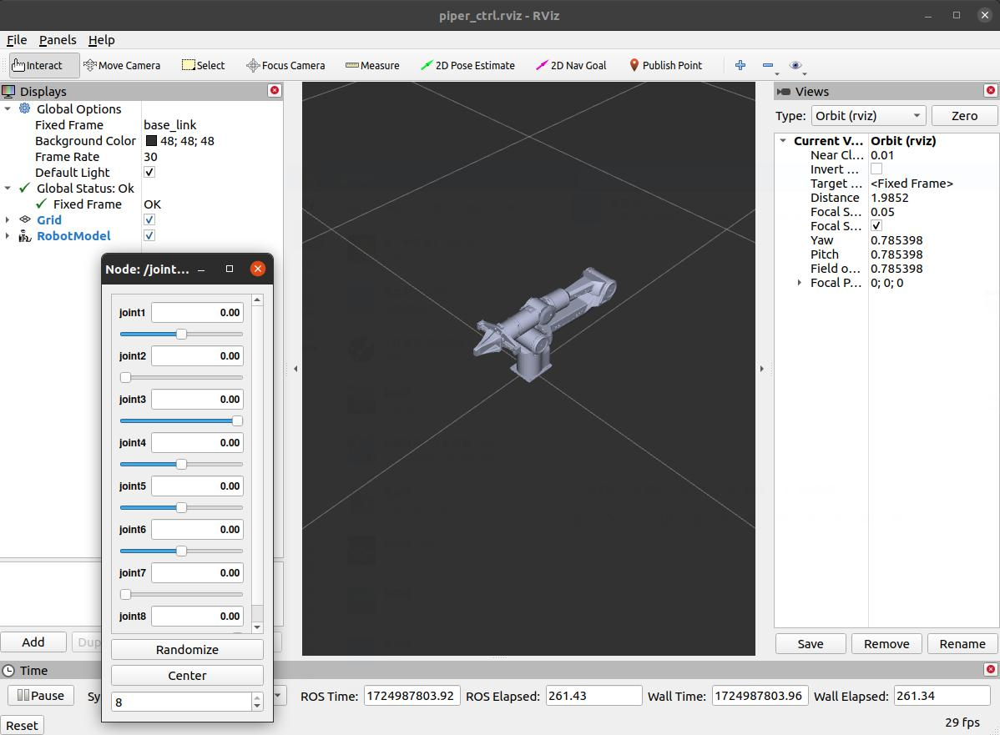

# AgileX Robotic Arm
 [CN](README.MD)

## Installation

### Install dependencies

```shell
pip3 install python-can
```

```shell
pip3 install piper_sdk
```

## Quick Start

### Enable CAN module

First, you need to set up the shell script parameters.

#### Single robotic arm

##### PC with Only One USB-to-CAN Module Inserted

- ##### Use the `can_activate.sh`  

Directly run:

```bash
bash can_activate.sh can0 1000000
```

##### PC with Multiple USB-to-CAN Modules Inserted

- ##### Use the `can_activate.sh`  script

Disconnect all CAN modules.

Only connect the CAN module linked to the robotic arm to the PC, and then run the script.

```shell
sudo ethtool -i can0 | grep bus
```

and record the `bus-info` value, for example, `1-2:1.0`.

**Note: Generally, the first inserted CAN module defaults to `can0`. If the CAN interface is not found, use `bash find_all_can_port.sh` to check the CAN names corresponding to the USB addresses.**

Assuming the recorded `bus-info` value from the above operation is `1-2:1.0`.

Then execute the command to check if the CAN device has been successfully activated.

```bash
bash can_activate.sh can_piper 1000000 "1-2:1.0"
```

**Note: This means that the CAN device connected to the USB port with hardware encoding `1-2:1.0` is renamed to `can_piper`, set to a baud rate of 1,000,000, and activated.**

Then run`ifconfig` to check if `can_piper` appears. If it does, the CAN module has been successfully configured.

### Running the Node

#### Single Robotic Arm

Node name: `piper_ctrl_single_node.py`

param

```shell
can_port:he name of the CAN route to open.
auto_enable: Whether to automatically enable the system. If True, the system will automatically enable upon starting the program.
#  Set this to False if you want to manually control the enable state. If the program is interrupted and then restarted, the robotic arm will maintain the state it had during the last run.
# If the arm was enabled, it will remain enabled after restarting.
# If the arm was disabled, it will remain disabled after restarting.
girpper_exist:Indicates if there is an end-effector gripper. If True, the gripper control will be enabled.
rviz_ctrl_flag: Whether to use RViz to send joint angle messages. If True, the system will receive joint angle messages sent by rViz.
# Since the joint 7 range in RViz is [0,0.04], but the actual gripper travel is 0.08m, joint 7 values sent by RViz will be multiplied by 2 when controlling the gripper.
```

`start_single_piper_rviz.launch`:

```xml
<launch>
  <arg name="can_port" default="can0" />
  <arg name="auto_enable" default="true" />
  <include file="$(find piper_description)/launch/display_xacro.launch"/>
  <!-- Start robotic arm node-->
  <node name="piper_ctrl_single_node" pkg="piper" type="piper_ctrl_single_node.py" output="screen">
    <param name="can_port" value="$(arg can_port)" />
    <param name="auto_enable" value="$(arg auto_enable)" />
    <param name="rviz_ctrl_flag" value="true" />
    <param name="girpper_exist" value="true" />
    <remap from="joint_ctrl_single" to="/joint_states" />
  </node>
</launch>
```

`start_single_piper.launch`:

```xml
<launch>
  <arg name="can_port" default="can0" />
  <arg name="auto_enable" default="true" />
  <!-- <include file="$(find piper_description)/launch/display_xacro.launch"/> -->
  <!-- Start robotic arm node -->
  <node name="piper_ctrl_single_node" pkg="piper" type="piper_ctrl_single_node.py" output="screen">
    <param name="can_port" value="$(arg can_port)" />
    <param name="auto_enable" value="$(arg auto_enable)" />
    <param name="rviz_ctrl_flag" value="true" />
    <param name="girpper_exist" value="true" />
    <remap from="joint_ctrl_single" to="/joint_states" />
  </node>
</launch>
```

Start control node

```shell
# Start node
roscore
rosrun piper piper_ctrl_single_node.py _can_port:=can0 _mode:=0
# Start launch
roslaunch piper start_single_piper.launch can_port:=can0 auto_enable:=true
# Or,the node can be run with default parameters
roslaunch piper start_single_piper.launch
# You can also use RViz to enable control by adjusting the parameters as described above.
roslaunch piper start_single_piper_rviz.launch
```

## Note

- You need to activate the CAN device and set the correct baud rate before you can read messages from or control the robotic arm.

### piper Custom Messages

ros package `piper_msgs`

 **Robotic Arm Status Feedback Message**: Corresponds to the feedback message with `id=0x2A1` in the CAN protocol.

`PiperStatusMsg.msg`

```c
uint8 ctrl_mode
uint8 arm_status
uint8 mode_feedback
uint8 teach_status
uint8 motion_status
uint8 trajectory_num
int64 err_code
bool joint_1_angle_limit
bool joint_2_angle_limit
bool joint_3_angle_limit
bool joint_4_angle_limit
bool joint_5_angle_limit
bool joint_6_angle_limit
bool communication_status_joint_1
bool communication_status_joint_2
bool communication_status_joint_3
bool communication_status_joint_4
bool communication_status_joint_5
bool communication_status_joint_6
```

End-effector pose control: Note that some singularities may be unreachable.

`PosCmd.msg`

```c
float64 x
float64 y
float64 z
float64 roll
float64 pitch
float64 yaw
float64 gripper
int32 mode1
int32 mode2
```

## Simulation

`display_xacro.launch` open rviz

After running, the `/joint_states` topic will be published. You can view it by /joint_states:


Two windows will appear simultaneously as follows. The slider values correspond to the `/joint_states` values. Dragging the sliders will change these values, and the model in rviz will update accordingly.


